# Project Overview

This project contains a full-stack web appliation:

- Frontend application
- Back-end API application
- Pipeline setup over CircleCi for automating tests and deployments

## Techstack & Links

- AWS is used as infrastructure provider, the following components are used:
  - RDS for hosting the Postgres database
  - S3 for hosting the static website(frontend) and storing uploaded images
  - ElasticBeanstalk for hosting the backend api
- CircleCi is used as CI/CD tool for automating tests and deployments

This is a [Link to the front-end application](http://shaher1327865590049.s3-website-us-east-1.amazonaws.com)

## Screenshots

1. The front-end page sign up process

   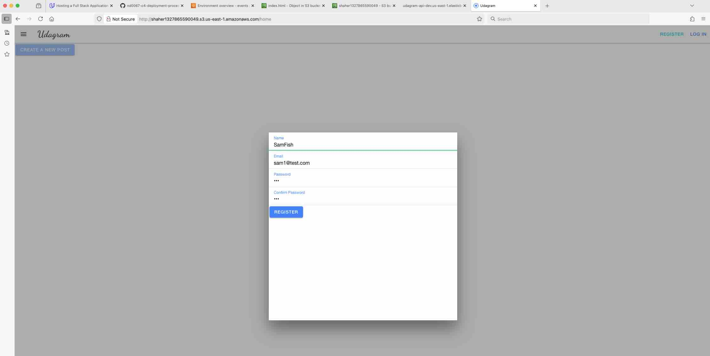

2. The front-end page after login / sign up

   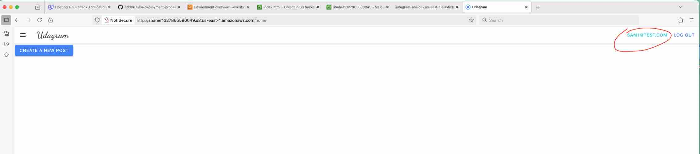

3. A post creted using the application

   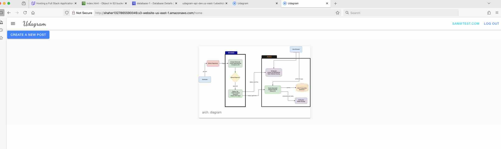

4. The back-end API application hosted on ElasticBeanstalk

   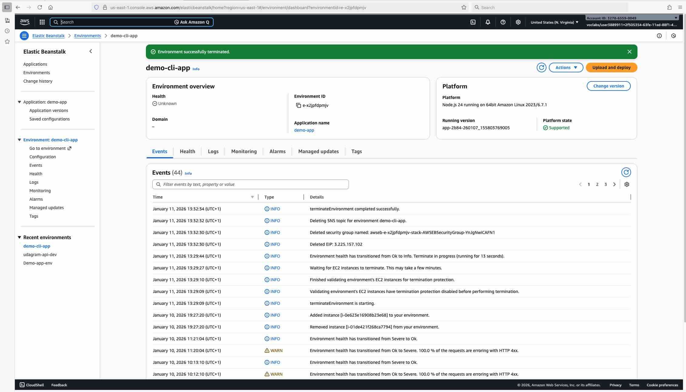

5. The RDS database instance hosting Postgres

   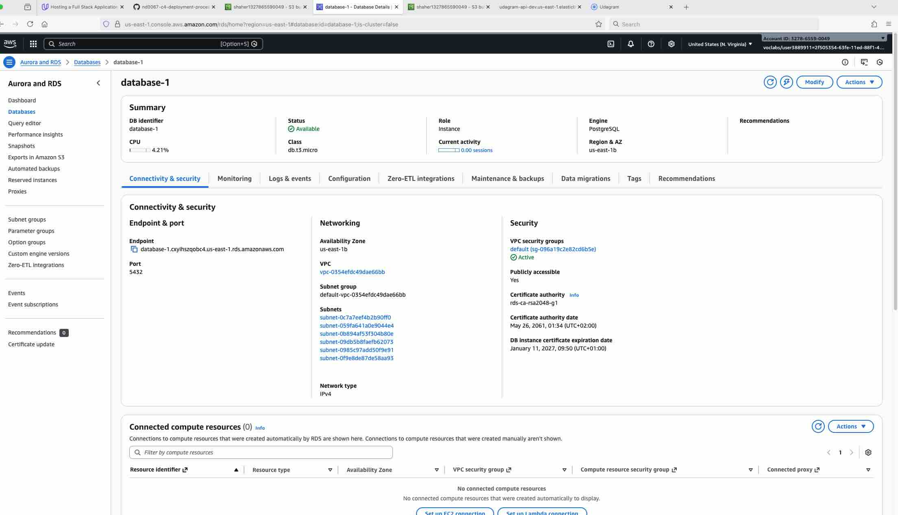

6. The S3 bucket hosting the frontend static website and uploaded images

   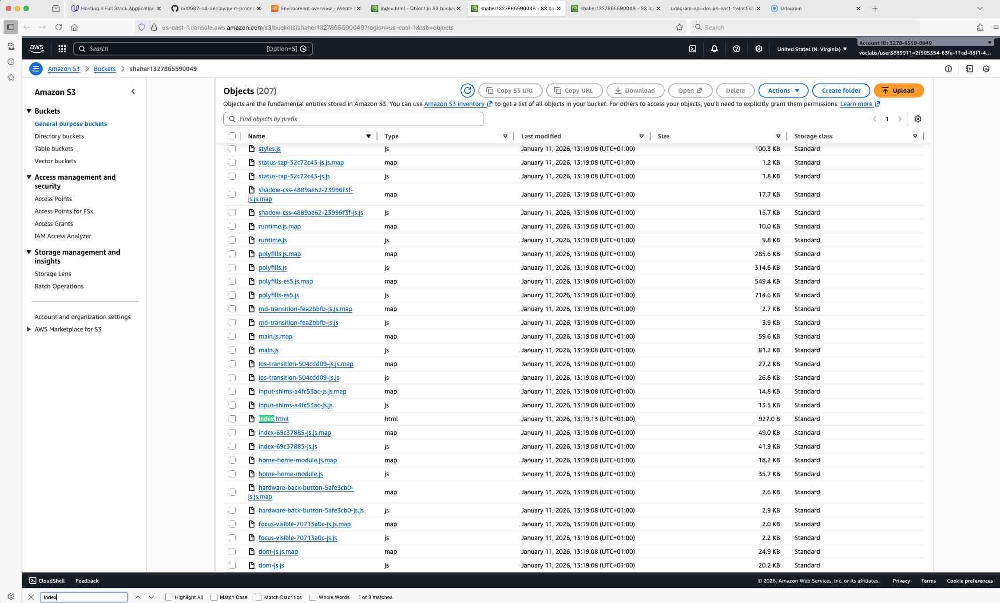

7. Environment vars on CircleCi

   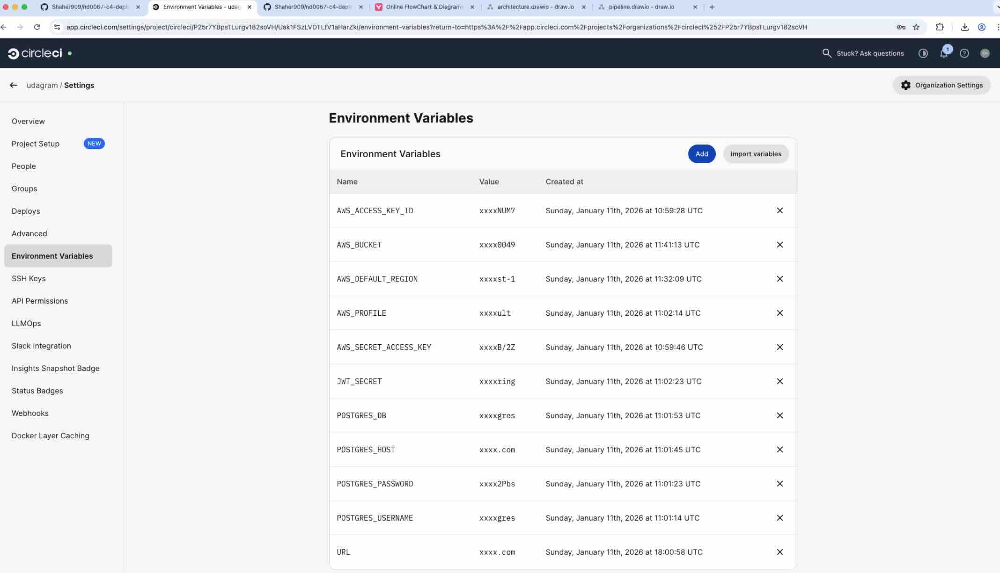

8. The deployment pipeline on CircleCi

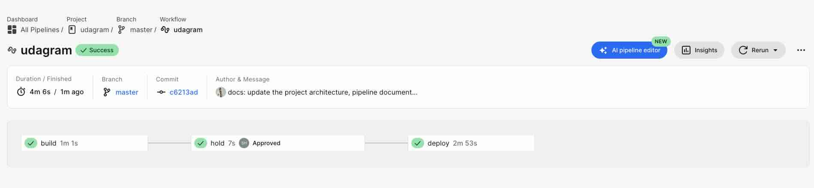

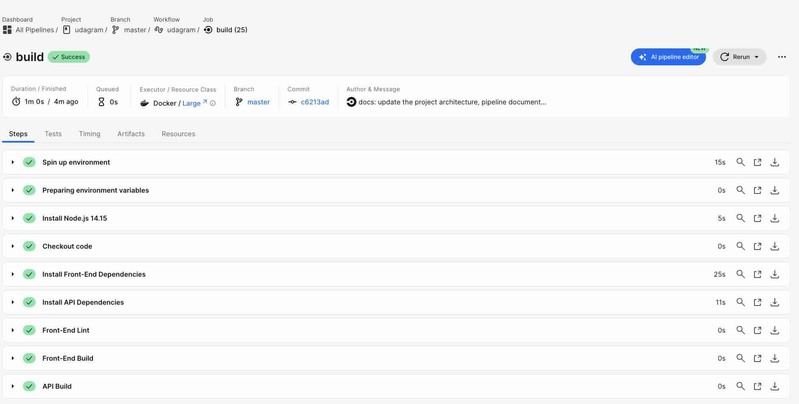
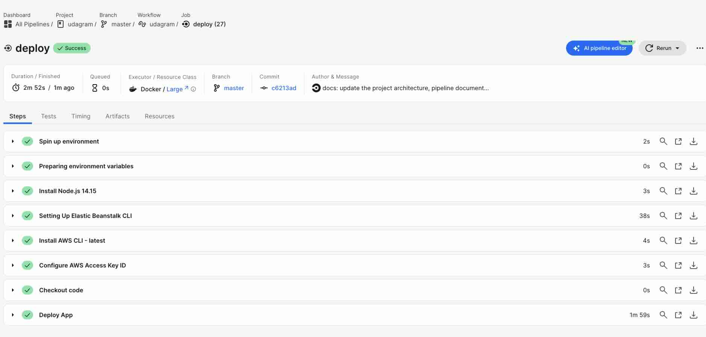

## Architecture

The following diagram illustrates:

- An architecture diagram showing a high-level overview of the infrastructure

- Pipeline diagram
  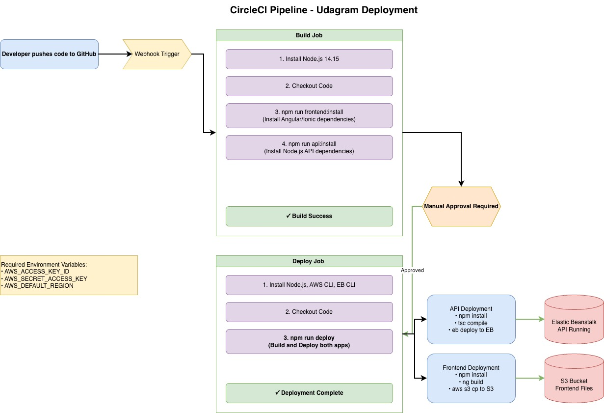
